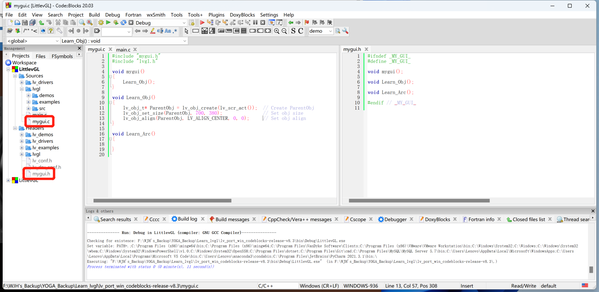
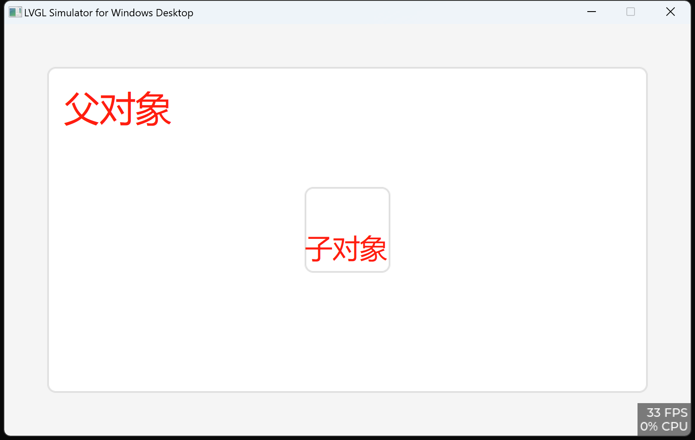

2023年9月1日

---

用 Codeblocks 仿真 lvgl

首先要在 GitHub 下载 lvgl 用于 Codeblocks 仿真的库。

注意红框中的两个文件夹中的内容是依赖文件，需要将其填充完整。

仿真环境搭建完成，新建 mygui.h 和 mygui.c 文件；并将其添加到 Codeblocks 的头文件、源文件文件夹中。

编写 mygui.h 和 mygui.c 文件；在 main.c 文件中包含 mygui.h 即可调用自编 gui。

# 学习 Obj 的使用方法，主要是父子对象之间的从属关系。

尝试让空间可拖动。

学习拖动事件处理函数，其本质是从输入设备获取输入坐标的改变，然后把改变值用于给空间重新设置位置。

若使用了 lv_obj_align 函数对要拖动的控件进行除了坐上对齐以外的对齐方式，会出现 bug，控件会不受控制地往右下方向跑。
该现象在单片机上运行时同样会出现。

# 学习 arc (lv_arc)

- arc 控件由3部分构成：
  - LV_PART_MAIN : A background like rectangle
  - LV_PART_INDICATOR : Indicator 用于指示数值的部分
  - LV_PART_KNOB : indicator 末尾的用于拖动的“小把手”
- arc 控件的
  - 0度是正右方向

# 学习 Animation Image (lv_animimg)

- animimg 控件是什么
  - 动态图
  - 可以存放一组图片，训话播放
- 部件
  - LV_PART_MAIN : 就一个大背景
- 图片源的使用
  - 函数 lv_animimg_set_src (lv_obj_t *img, const void *dsc[], uint8_t num)
    - img: pointer to an animation image object 动图对象指针
    - dsc: pointer to a series images 指向一些列图的指针
    - num: images' number 图片数量
  - 注意，图像源是结构体指针，不是文件。

# 学习 Bar 控件 (lv_bar)
- 构成部件
  - 背景
  - 指示器
- 在用 style 的时候要注意，一个 style 结构体对应一种风格，因为定义时是用 static 的，所以不可以用同一个 style，先应用在一个控件上，更改style，在应用在另一个控件上。
- 创建子对象，其显示范围在父对象的边界内，超出边界不显示。